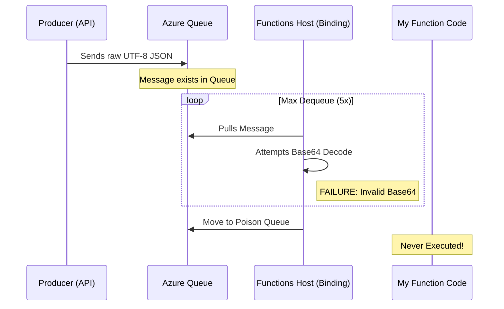

# Debugging Azure Functions: The Case of the "Invisible" Poison Queue


I recently started working on PluckIt, after learning a bit in preparation for AZ 204, I wanted to work on something hands on. I decided to move beyond theory and "mess around" with serverless architecture by building something from scratch.

While evolving the application, I decided to transition the image upload pipeline into an asynchronous flow. The goal was simple: the user uploads an image, the API returns a 202 Accepted immediately, and a background Azure Function handles the heavy lifting of image processing via a Storage Queue. However, I quickly ran into a frustrating roadblock where the messages were disappearing before my code could even touch them.


This post breaks down a **debugging journey**

------------------------------------------------------------------------

# The Symptom: Immediate Dequeue Failure

The workflow appeared healthy from the outside:

-   The HTTP response returned **202 Accepted**
-   The initial metadata was persisted in **Azure Cosmos DB**

However, the **asynchronous image processing never triggered**.

## Observed Behavior

-   **Rapid Failure:** Messages moved to `image-processing-jobs-poison`
    in under one second
-   **No Logs:** There were zero `ProcessImageJob` invocation logs or
    stack traces
-   **Host Error:**


```
    Message has reached MaxDequeueCount of 5. Moving message to queue 'image-processing-jobs'.
```

Because the worker code **never executed**, the issue was clearly
isolated to the **Host / Binding layer**.

------------------------------------------------------------------------

# Technical Investigation

To isolate the cause, I moved from the application UI to **raw CLI
tools** to observe the host's behavior in a controlled environment.

------------------------------------------------------------------------


# 1. Verbose Host Inspection

I was stuck in a loop of guessing. I thought some kind of base64 encoding might be the culprit, so I spent an hour toggling between None and Base64 on the producer side, and even tried forcing different encodings in the Function trigger attributes. I spent time troubleshooting my QueueTrigger registration, thinking the host wasn't seeing the function at all.

Not even Copilot could help me in tracing out what the issue was, so after a long time stuck cluelessly, I shifted my strategy from application-level debugging to host-level inspection using the --verbose flag.

Running the Functions host with the `--verbose` flag revealed how the
runtime was interpreting `host.json`.

``` bash
func start --port 7072 --verbose
```


## The Discovery

The logs showed the `QueuesOptions` were **defaulting to Base64
encoding**, despite local configurations.

A critical log line appeared:

```
    Extension Bundle not loaded. DotnetIsolatedApp: True.
```

------------------------------------------------------------------------

# 2. Manual Queue Manipulation

Using the **Azure CLI**, I bypassed the application producer to test the
consumer's expectations directly.

## Peek at the failing messages

``` bash
az storage message peek   --queue-name image-processing-jobs   --account-name <ACCOUNT>
```

## Inject a raw JSON test message

``` bash
az storage message put   --queue-name image-processing-jobs   --content '{"itemId":"test-001"}'
```

------------------------------------------------------------------------

# The Root Cause: Encoding Mismatch

In **.NET Isolated Worker models**, the relationship between `host.json`
and the runtime can be subtle.

The host was configured (by default) to expect **Base64 encoded
strings**.

However, the `QueueClient` in the producer service was sending **raw
UTF-8 JSON**.

## What Actually Happened

    Producer sends raw string: {"id": 123}
    Host attempts to Decode Base64 -> Failure
    Host retries 5 times instantly
    Host moves "malformed" message to the poison queue

------------------------------------------------------------------------

# The Fix: Aligning the Producer

The most robust solution was to ensure the **producer explicitly matches
the host's default expectation**.

------------------------------------------------------------------------

# Code Change (Program.cs)

The `QueueClient` instantiation was updated to include the correct
encoding option.

## Before

``` csharp
var queueClient = new QueueClient(queueConnStr, queueName,
    new QueueClientOptions { MessageEncoding = QueueMessageEncoding.None });
```

## After (Fixed)

``` csharp
// Align with dotnet-isolated default host behavior
var queueClient = new QueueClient(queueConnStr, queueName,
    new QueueClientOptions { MessageEncoding = QueueMessageEncoding.Base64 });
```

------------------------------------------------------------------------

# Configuration Update (host.json)

While the code change fixed the functional gap, `host.json` was updated
to ensure **consistency across environments**.

``` json
{
  "extensions": {
    "queues": {
      "messageEncoding": "base64"
    }
  }
}
```

------------------------------------------------------------------------

# Verification

After applying the fix, the host successfully decoded the messages.

The logs finally confirmed the worker was being invoked:

```
    [2026-03-04T16:46:16.705Z] Executing 'Functions.ProcessImageJob' (Reason='New queue message detected...')
    [2026-03-04T16:46:16.713Z] ProcessImageJob: starting for item test-base64-001...
    [2026-03-04T16:46:16.744Z] Executed 'Functions.ProcessImageJob' (Succeeded)
```

------------------------------------------------------------------------

# Lessons Learned

## Silent Poisoning = Binding Issue

If a message hits the poison queue **without a single line of your code
executing**, check your **triggers and encodings first**.

## Trust Verbose Logs

`func start --verbose` output is the **source of truth** for what the
runtime actually hears, regardless of what you wrote in config files.

## Encoding is a Contract

The **Producer and Consumer must explicitly agree on the wire format**.

    Base64 vs None is not a preference — it's a contract.

------------------------------------------------------------------------

# Final Takeaway

In distributed systems, when things fail **instantly and silently**, the
bug might **not be in your code**, but in the **contract between
systems**.

In Azure Functions queue triggers, **message encoding is part of that
contract**.
