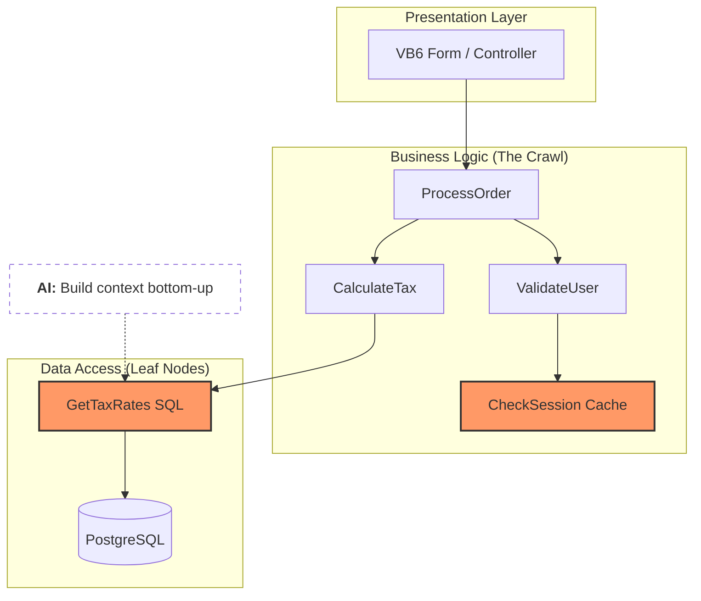

Deconstructing the Monolith: A Graph‑Based Approach to Legacy Migrations

My first major project involved migrating a **massive VB codebase to .NET**. It was a grueling manual process: line‑by‑line replication, sanitizing SQL injection vulnerabilities, and manually porting T‑SQL to PostgreSQL functions.

Back then, tools like Copilot weren’t advanced enough to handle the *“spaghetti”* of a **2,000‑line `.aspx.vb` file**.

Recently, I revisited this problem to automate the **discovery phase** that previously took weeks.  
This led to building a **Migration Graph Engine** tool that is designed to analyze legacy applications and guide automated transformations with **70% first‑pass accuracy**.

---

# Architecture Overview

Traditional AI migrations struggle because they lack **context across files, modules, and database calls**.

The solution: build a **global dependency graph** of the entire application before attempting transformation.

Key design principles:

- Treat the codebase as a **system of interconnected functions**
- Trace **data lineage** through dependency traversal
- Feed AI **small, highly contextual packets of code** instead of entire files

---

# 1. Multi‑File Discovery & Traversal

`.aspx.vb` files are rarely self‑contained.  
They often rely on:

- shared `.vb` modules
- global variables
- utility classes
- database wrappers

## Building the Global Dependency Graph

Instead of performing a naive text search, the engine parses the codebase and constructs a **Directed Acyclic Graph (DAG)** representing function dependencies.

### Recursive Function Resolution

When the parser encounters a function call like:

```vb
UpdateUser()
```

it checks whether the implementation exists locally.

If the function exists in another module (for example `DBHelper.vb`), the engine:

1. Jumps to the external file
2. Parses the logic
3. Adds it to the dependency graph as a **child node**

---

### Reaching the Leaf Nodes

Traversal continues until the engine encounters **Leaf Nodes**, which represent the final I/O operations:

- raw SQL execution
- filesystem access
- external API calls

These nodes represent the **true behavioral endpoints of the system**.

---

### Data Lineage Tracking

Once leaf nodes are identified, the engine can reconstruct **data lineage**.

Example:

```text
UserID → Function Parameter → SQL Query
```

This allows the engine to automatically identify SQL queries so that the agent could then:

- detect SQL injection risks
- enforce parameterized queries
- understand where sensitive data enters the system

This would happen through a multi step process. I split the code, sql and other functionalities to go through multiple passes with an LLM. 

---

# 2. Intent‑Based Keyword Expansion

Legacy code often uses patterns that modern tools misunderstand.

To bridge this gap, the engine maintains a **Keyword Watchlist** that signals transformation intent.

| Signature Category | Legacy Pattern | Refactoring Directive |
|---|---|---|
| Data Access | `SqlCommand`, `SqlDataReader` | Replace with Repository pattern |
| State Management | `Session()`, `ViewState()` | Convert to DTOs or Scoped Services |
| Cross‑File Dependencies | `Module`, `Public Shared` | Map to Dependency Injection |
| UI Coupling | `Me.DataBind()`, `sender` | Isolate logic into API layer |

---

# 3. Taming the 2,000‑Line Code‑Behind

Feeding extremely large files to an AI model leads to **context drift**, where variable types, scopes, and dependencies are forgotten.

## Sub‑Graph Extraction Strategy



Instead of processing entire files, the migration engine extracts **functional units**.

### Step 1 — Entry Point Identification

Example:

```vb
Button_Click event
```


### Step 2 — Dependency Assembly

The engine collects:

- the event handler code
- all internal method calls
- any external dependencies identified during graph traversal

### Step 3 — Context Packet Generation

The AI receives a **300–500 line packet** containing only the relevant code required to refactor the feature.

This dramatically improves transformation accuracy.

---

# 4. Layered Migration Strategy

To avoid the AI **inventing missing infrastructure**, migration occurs in a strict order.

## Step 1 — Shared Utilities

Shared `.vb` modules and database wrappers are migrated first into:

- .NET Core services
- reusable libraries

## Step 2 — Reference Injection

When migrating the main `.aspx.vb` files, the engine provides the AI with:

- the already converted **C# service implementations**
- the expected **target architecture**

## Step 3 — Target Pattern Enforcement

Instead of directly translating legacy SQL strings, the agent receives transformation rules:

> If a legacy SQL update call is detected, replace it with  
> `IUserRepository.Update()` from the new service layer.

---

# Technical Outcomes

Moving from a naive **text‑to‑text migration** to a **graph‑based discovery system** produced major improvements.

## Accuracy

- Achieved **70% first‑pass conversion accuracy**
- Even on extremely large code‑behind files

## Security Improvements

Leaf node tracing allowed the system to:

- detect raw SQL queries
- enforce **parameterized Postgres queries**
- reduce SQL injection risk automatically

## Maintainability

The resulting codebase is not just translated — it is **architecturally modernized**.

The output:

- reusable service layers
- dependency injection patterns
- cleaner API boundaries

---

# Key Takeaway

Legacy migrations are slow not because rewriting code is hard.

They are slow because **understanding the system is hard**.

By modeling legacy applications as **dependency graphs**, we can transform chaotic monoliths into structured systems that AI can reason about effectively.
